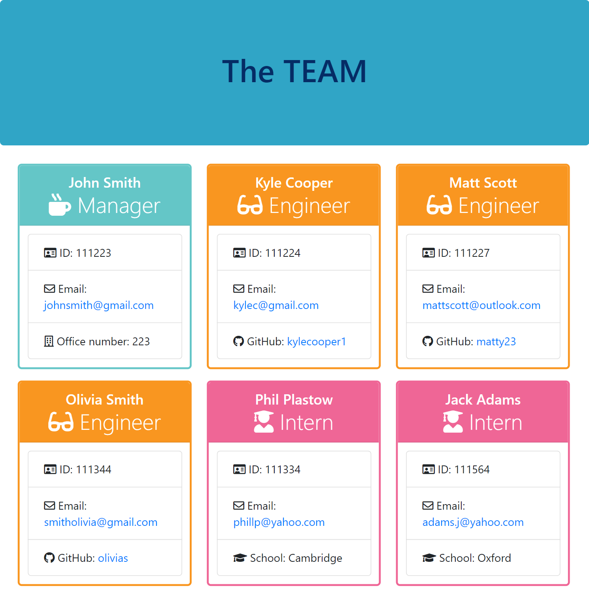

# Team-Profile-Gen

## Table of Contents:
  1. [Description](#description) 
  2. [Installation](#installation)
  3. [Usage](#usage)  
  4. [Tests](#tests)
  5. [Output-Demo](#output-demo)
  6. [License](#license)
  7. [Questions](#questions)

  ## Description  

  This is a Node.js command-line application for creating a team profile webpage. This application will take in information about employees on a software engineering team, then generate an HTML webpage that displays summaries for each person. Also there are tests provided to make sure that the application is built correctly when every part of your code passes each provided test. The code is written in index.js and uses Inquirer to gather information about the development team members and creates objects for each team member using the correct classes.
  
  The application accepts one manager and multiple engineers and interns. When a user decides to finish building their team, they exit the application and the HTML is generated.

  ## Installation

  To install the necessary dependencies please run the following command: 
  > npm i

  ## Usage

  The application usses <a href="https://www.npmjs.com/package/jest">Jest</a> for running unit tests and <a href="https://www.npmjs.com/package/inquirer">Inquirer</a> for collecting input from the user. The application will be invoked by using the following command:
  > node index.js

  Example:
  
  

  ## Tests

  To run tests please run the following command:
  > npm test
  
  Example:
  
  

  ## Output-Demo

  This is a generated output HTML page to demonstrate the final look based on six exployees data.

  

  ## License

  This project is licenced under the  "MIT" license.

  

  ## Questions

  For any questions regarding this repo, please contact me directly at vali@github.com. You can find more of my work at [vali
  ](https://github.com/valimanea).
 